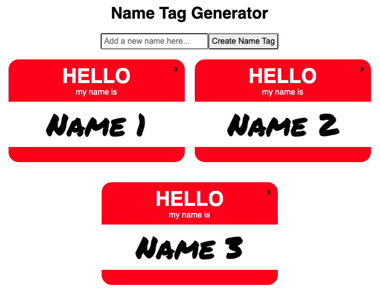

# Name Tag Generator
An interactive web application built with React JS.

## About
With this simple Name Tag Generator app, users can:

- create new name tags based on their name input
- delete name tags

The app saves data between sessions to the brower's local storage. This prevents current name tags from disappearing when the browser is closed, and users will be able to see their name tags when they re-open the browser.  

## Project Background
The Name Tag Generator was built as part of Skillcrush's "Introduction to JavaScript React" course. 

During this project, I practiced: 

- How to build, render, and pass props to a functional component pulling static data. 

- How to build and render an array data model, including mapping over the array with a callback function.  

- How add interactivity to the app by converting a functional component to a stateful component, building additional React modules, and handling user input by adding event handlers and event listeners, and passing props. 

-  How to use lifecycle methods to save user data between sessions. 

## Built With 
- React.js
- ES6 
- JSX
- CSS3
- HTML5

## Acknowledgements

**Skillcrush** - I coded the Name Tag Generator app's React files with support and guidance from Skillcrush. The app's HTML and CSS files and their contents were provided by Skillcrush.  